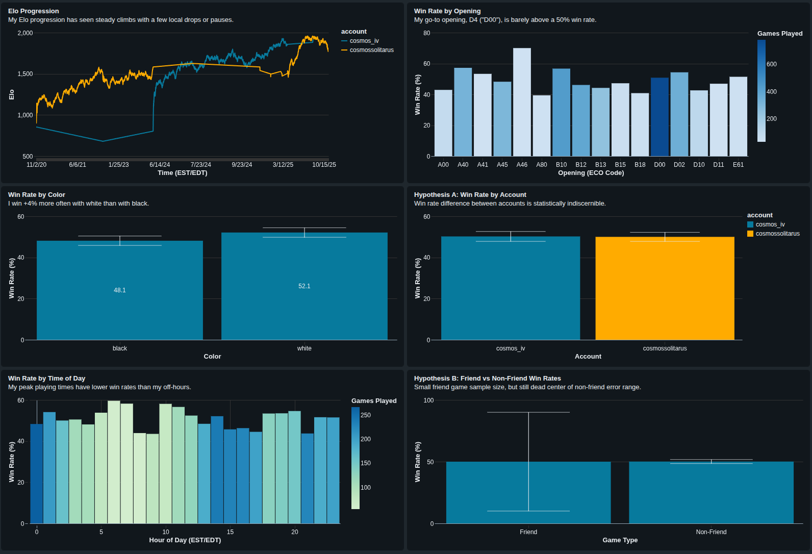
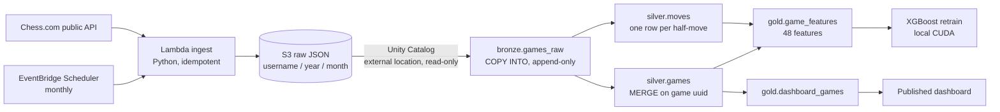

# Chess Analytics Pipeline and Dashboard

Can I predict whether I'll win a chess game before it starts — from context alone?
In 2024 I answered that with an ad-hoc local pipeline
([ChessAnalytics](https://github.com/Jack-H-Roberts/ChessAnalytics)): scripts,
CSVs, and manual runs. This repo is the same idea rebuilt as a **governed,
scheduled pipeline**: AWS ingestion, medallion Delta tables in Databricks,
orchestration with tested failure alerts, a published dashboard, and the
XGBoost model retrained on top.

## Architecture

A scheduled **Lakeflow job** (bronze → silver → gold → checks) refreshes the
lakehouse monthly, ~45 minutes after the Lambda lands new data, with an email
alert on failure that I have deliberately broken once to watch fire. The
dashboard refreshes on its own schedule an hour after the job.

## Ingestion — one idempotent sync, not a backfill script plus a cron

Every Lambda invocation does the same thing: ask the API which monthly
archives exist per account, list which `username=/year=/month=` partitions
already exist in S3, fetch whatever is missing, and always re-pull the two
most recent months so the in-progress month stays fresh and the just-closed
month gets its final games. Consequences that fall out for free:

- The **first invocation of an empty bucket is the backfill** — 48 archives,
  5,769 games across my two accounts, in about 16 seconds. Incremental runs
  take ~2 seconds.
- A failed month never lands, so the next run retries it automatically.
- Every pull writes a **new timestamped snapshot file** rather than
  overwriting, which makes bronze a true append-only audit trail and gives
  `COPY INTO`'s file tracking something coherent to track.

Ingestion lives in AWS rather than Databricks because Databricks Free
Edition's serverless compute restricts outbound internet to trusted domains —
the Chess.com API is unreachable from inside the platform. Two IAM roles with
opposite one-way permissions connect the halves: the Lambda's role can write
to the raw prefix but never read; the Unity Catalog storage credential can
read but never write. The external location is marked read-only and file-event
provisioning is declined — at four new files a month, directory listing is the
right tool and event infrastructure would be resume-driven overengineering.

## Medallion layers — each write strategy chosen for a reason

**Bronze** mirrors the source's shape: one row per landed snapshot file, the
month's `games` array intact, with file path, modification time, and ingest
time as provenance. `COPY INTO` makes the append idempotent.

**Silver** normalizes grain and types everything: `silver.games` (one row per
game per account-perspective — the composite key exists because my two
accounts could in principle appear in the same game) and `silver.moves` (one
row per half-move with clock times, standard chess only — variant movetext
like bughouse piece-drops is a different grammar). The trailing-month re-pulls
mean bronze genuinely contains duplicates (235 at first build), and **MERGE on
the game uuid** is what collapses them — deduplication that is load-bearing,
not decorative. Friend games, unrated games, and variants all stay in silver
with flags; filtering is gold's job.

**Gold** holds the **48-feature table** for the model population (3,635 rated,
standard-rules rapid games) plus the dashboard view. Feature rows are rapid
games, but the *context* they carry — games already played, rolling
win/draw/loss rates over 24 hours and 7 days, last two results, time since
last game — is computed over my **entire activity timeline**: both accounts,
every time class, rated or not. Twenty blitz losses before a rapid session are
real fatigue; the 2024 pipeline was structurally blind to them. Every window
looks strictly backward, so gold is a deterministic projection of silver and
is rebuilt wholesale each run — MERGE belongs where duplicates occur, and
they occur in silver.

**Checks** run as the job's final task: schema contracts on both silver
tables, key uniqueness (the MERGE invariant), row-count floors,
bronze-to-silver reconciliation, referential integrity between moves and
games, and a mechanical assertion that **gold has exactly 48 features** — the
number in my documentation is a constraint that fails the job if it drifts,
not a hope. Delta enforces schema on every write underneath all of this.

## Things the rebuild caught

Rebuilding forced every 2024 assumption through stricter machinery, and the
machinery pushed back:

- **The old move parser silently dropped promotions.** Its regex character
  class lacked `=`, so `e8=Q+` never matched. The rebuilt parser recovers
  **879 promotion moves** (of 330,220 total) the old pipeline never saw.
  Same family: castling detection now matches `O-O+`/`O-O#` (castling with
  check), which exact-string comparison missed.
- **75 of my ten-minute games are classed `blitz`, not `rapid`,** by
  Chess.com itself — legacy classification on my oldest account. They stay
  out of the model population because ratings are per-time-class ladders:
  those rows carry blitz Elo, and mixing ladders would corrupt both Elo
  progression and the rating-difference feature. My quality checks put the
  time_class × time_control crosstab on the record.
- **Spark's ANSI mode refused to parse empty timestamps** the 2024 pandas
  code would have silently coerced to NaT — which is how I learned that all
  994 of my bughouse games lack PGN headers. That became a permanent check:
  variants may have null start times; standard chess may not.
- **I castle short in only 44.6% of my rapid games.** Low enough that I
  verified it against the actual games on Chess.com before believing it
  (silver keeps every game URL for exactly this). The number stands; the
  finding is about my play style, not my parser.
- **17% of my raw history is bughouse.** The old `TimeControl == 600` filter
  could have admitted ten-minute variants; the rebuild filters on the API's
  `rules` field instead.

## The model — honest numbers, and why the ceiling is low

`model/train_model.py` ports the 2024 design intact — XGBoost
`multi:softprob`, Optuna search with 10-fold stratified CV, chronological
holdout, class weighting — and swaps the data source: it reads
`chess.gold.game_features` directly over the Databricks SQL connector
(credentials via environment variables, never in code). It trains on a
deliberate **28-feature subset** of the 48: pre-game context and opening
only. The excluded 20 are things unknowable before the game (castling, move
counts, time usage) plus features that are degenerate within the population
(time control is 600 seconds in all but 11 of 3,635 games).

Holdout accuracy is **50.6% against a 48.6% majority-class baseline**. That
gap is small, and it should be: matchmaking is an adversary that engineers
every pairing toward a coin flip — my average rating difference per game is
0.5 Elo. The value of this model was never oracle accuracy; it's the feature
effects. The 2024 iteration surfaced that I lost disproportionately late at
night and immediately after consecutive defeats, and changing those habits
coincided with a ~15% rise in my win rate (documented in the original repo).
The class weighting effectively binarizes the problem — draws (~4% of games)
are treated as noise for a win-focused question, so the model spends no
probability mass on them.

The dashboard's hypothesis tiles carry the descriptive findings: my two
accounts' win rates are statistically indistinguishable (the account
distinction is about ladders, not skill), and my small friend-game sample
sits dead center of the non-friend error range.

## Costs and honesty about scale

The whole system costs pennies per month: a few megabytes of S3, ~18 seconds
of Lambda per month, free-tier scheduling, and Databricks Free Edition. And
to be direct: 5,769 games do not need distributed compute — the 2024 pipeline
processed everything locally in under a minute. Spark, Delta, and Unity
Catalog are here because the *pattern* is the point: governed incremental
loads, enforced contracts, scheduled orchestration, and alerts that have been
proven to fire. The same shape — scheduled external ingestion into an
append-only raw layer, keyed MERGE deduplication, contract checks gating a
serving layer — is how I'd structure payments records, tax rolls, or any
government-style dataset where auditability and literal correctness matter
more than volume.

## Repo layout

| Path | Contents |
|---|---|
| `ingestion/` | The Lambda function (idempotent archive sync to S3) |
| `databricks/` | Notebooks: `01_bronze`, `02_silver`, `04_gold`, `03_checks` — the Lakeflow job's tasks |
| `model/` | Local CUDA training script reading the gold layer (artifacts gitignored) |
| `scripts/` | One-off tooling, starting with the pre-build game-count verification |
| `docs/img/` | Dashboard export and selected model charts |

No secrets anywhere in this repo: AWS access is IAM-role-based on both sides,
and the training script takes its Databricks credentials from environment
variables.

## Future work

Time-series cross-validation to replace the shuffled folds used during
tuning; a calibrated or explicitly binary win model; adding the account flag
to the feature set as a controlled test of the account-equivalence
hypothesis; move-level features flowing into gold (silver already carries
the grain); blitz as a second modeled population; infrastructure-as-code for
the AWS half.

---
*Part of my portfolio — [jackhroberts.dev](https://jackhroberts.dev)*
